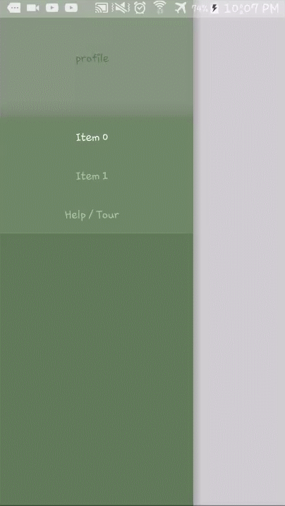

[](http://www.repostatus.org/#active)

FlabbyNavigationDrawer
=============
A Flabby ViewPager as a Navigation Drawer.

## Appearance



## Quick Start

> Gradle

```xml
   dependencies {
        implementation 'com.github.54LiNKeR:FlabbyNavigationDrawer:1.0.0'
    }
```

> XML

```xml
           <linkersoft.blackpanther.flabb.FlabbyNavigationDrawer
               android:layout_width="match_parent"
               android:layout_height="match_parent"
               app:size="HALF"
               app:flabbcolor="#40ffffff">

                       <View
                           android:layout_width="match_parent"
                           android:layout_height="match_parent"
                           android:id="@+id/NavigationItems"
                           android:background="#208000ff"/>

           </linkersoft.blackpanther.flabb.FlabbyNavigationDrawer>
```

